<!-- ===================================================== -->

<!--                       HEADER                          -->

<!-- ===================================================== -->

<div align="center">


<a href="https://git.io/typing-svg">
  
</a>

<br/>

<a href="https://devcorreria.com.br/">
  
</a>
<a href="https://www.linkedin.com/in/ruan-tarcisio/">
  
</a>

<br/><br/>

`Software Engineer @ Guacon / Indeed` • `Founder @ Vibraventura` • `Salvador, Bahia 🇧🇷`

</div>

---

## 🧑🏽‍💻 Sobre mim

Sou **Software Engineer Full Stack**, com uma afinidade especial por backend, arquitetura e desenvolvimento de produtos.

Hoje trabalho em um projeto da **Indeed**, lidando com aplicações em ambiente de alta escala e tecnologias como **Java, Spring Boot, GraphQL, MongoDB, Thymeleaf e Datadog**.

Meu interesse por engenharia vai além de fazer o código funcionar. Gosto de entender **por que estamos construindo algo, como a solução se comporta em produção, como podemos observá-la e qual impacto ela gera para o usuário**.

Também sou fundador e engenheiro por trás do **Vibraventura**, onde vivo um lado diferente da engenharia: conversar com usuários e operadores, descobrir problemas, tomar decisões de produto, desenhar a arquitetura e transformar essas decisões em software.

E quando não estou na frente do monitor, provavelmente estou procurando alguma trilha, entrando no mar ou jogando basquete. 🥾🌊🏀

---

## `~/now`

```java
public class Ruan {

    String role = "Software Engineer";

    String[] building = {
        "Indeed @ Guacon",
        "Vibraventura"
    };

    String[] interestedIn = {
        "Software Architecture",
        "Distributed Systems",
        "Observability",
        "Product Engineering",
        "AI Engineering"
    };

    String philosophy =
        "Understand the problem before increasing the complexity.";
}
```

---

# 🚀 O que estou construindo

<table>
<tr>
<td width="50%" valign="top">

### 🌎 Vibraventura

**Produto real. Problemas reais. Decisões reais.**

Marketplace para descoberta e reserva de experiências de turismo, natureza e aventura.

Atuo de ponta a ponta:

* arquitetura;
* backend e APIs;
* frontend;
* autenticação;
* reservas;
* comunicação;
* infraestrutura;
* produto e validação.

**Stack**

`Java` `Spring Boot` `PostgreSQL`
`Next.js` `React` `TypeScript` `Docker`

<br/>

<a href="https://devcorreria.com.br/pt/work">
  
</a>

</td>

<td width="50%" valign="top">

### ⚡ OrderFlow

**Meu laboratório de sistemas distribuídos.**

Projeto onde exploro os problemas que aparecem quando uma aplicação deixa de ser apenas um processo.

```text
Order
  │
  ├── Inventory
  ├── Payment
  └── Notification
        ↕
      Events
```

**Stack**

`Spring Boot` `Kafka` `RabbitMQ`
`Gateway` `Resilience4j` `Docker`

<br/>

**Objetivo:** entender quando distribuição e assincronismo resolvem mais problemas do que criam.

</td>
</tr>
</table>

---

# 🛠️ Tech

<div align="center">

### Backend


`Spring Boot` • `Spring Security` • `JPA / Hibernate` • `REST` • `GraphQL`

<br/>

### Frontend


`React` • `Next.js` • `TypeScript` • `Thymeleaf` • `Zustand`

<br/>

### Data


`PostgreSQL` • `MongoDB` • `MySQL` • `SQL` • `Data Modeling`

<br/>

### Cloud, DevOps & Observability


`AWS` • `Docker` • `CI/CD` • `Datadog` • `Prometheus` • `Railway` • `Vercel`

<br/>

### Distributed Systems


`Kafka` • `RabbitMQ` • `Spring Cloud Gateway` • `Resilience4j` • `Event-Driven Architecture`

</div>

---

# 🧠 Engenharia, para mim

<div align="center">

### `Engineering × Product × Business`

</div>

Não tenho muito interesse em adicionar complexidade apenas para deixar uma arquitetura mais sofisticada.

Prefiro começar pelas perguntas:

> **Qual problema estamos tentando resolver?**

> **Como saberemos se a solução está funcionando em produção?**

> **O usuário percebe valor nisso?**

> **Essa decisão torna o sistema mais fácil ou mais difícil de evoluir?**

Minha experiência construindo produto e trabalhando com software em produção tem aumentado cada vez mais meu interesse pela interseção entre **arquitetura, observabilidade, métricas e produto**.

---

# 📈 Engineering Activity

<div align="center">




<br/>



<br/><br/>


</div>

---

# 🟩 Keep building.

<div align="center">

<picture>
  <source
    media="(prefers-color-scheme: dark)"
    srcset="https://raw.githubusercontent.com/RuanTarcisio/RuanTarcisio/output/github-contribution-grid-snake-dark.svg"
  />
  <source
    media="(prefers-color-scheme: light)"
    srcset="https://raw.githubusercontent.com/RuanTarcisio/RuanTarcisio/output/github-contribution-grid-snake.svg"
  />
  
</picture>

</div>

---

# 🌱 `Beyond code`

Nem tudo precisa virar `commit`.

<div align="center">

🥾 **Trilhas**    •   
🌊 **Snorkel & natureza**    •   
🏀 **Basquete**    •   
🚀 **Produtos & startups**

</div>

<br/>

Parte dessa vontade de **descobrir lugares, pessoas e experiências diferentes** acabou se transformando no Vibraventura.

Talvez seja por isso que gosto tanto de construir produtos: nos dois casos existe alguma coisa nova para descobrir.

---

# 🌍 English

**B2 — Intermediate / Upper-Intermediate**

Uso inglês no ambiente profissional para comunicação, documentação, discussões técnicas e colaboração com equipes internacionais.

---

<div align="center">

# ☕ Let's build something.

Gosto de conversar sobre **Java, arquitetura, sistemas distribuídos, produtos digitais, startups e engenharia de software**.

<a href="https://www.linkedin.com/in/ruan-tarcisio/">
  
</a>

<a href="mailto:dev.correria@gmail.com">
  
</a>

<a href="https://devcorreria.com.br/">
  
</a>

<br/><br/>

**Salvador, Bahia 🇧🇷**


</div>
